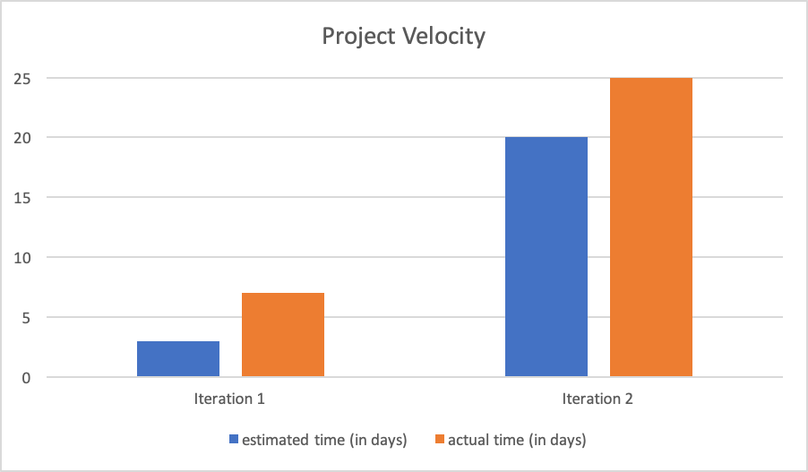

##                                                                        Retrospective

When taking a look at the project, specifically for the last iteration, a part of the project that has not met our expectation was meeting within-iteration deadlines(sub-deadlines) with essential code and dealing with bugs/issues promptly as they arose in the iteration. This became an obstacle in developing tests and integration of our system, essentially deferring large amounts of high priority work to be dealt with very late in our iteration timeline. 

For example, in iteration two we used a SQL-based database engine to implement the real database by joining with HSQLDB. We determined a plan for our iteration early but put off difficult but essential tasks rather than prioritizing them as they arose(effectively ignoring the soft-deadlines we had set for specific code). No issues arose in putting all the tables and the initial data in the script files, but without the ability to connect the script file to the database and implement functions in the database classes we could not run the application or any of the tests using it. 

In order to avoid this problem in the future, the iteration will be broken up to smaller sub-deadlines that should we assign very specific tasks to have accomplished by(roughly 1 each week). For example, we as a team agreed that we should start early and make sure that code related to testing and integrating the new functions such as the database layer for a feature is prioritized and completed by our first sub-deadline.
In implementing any new features, important bugs/issues will be dealt with by the next sub-deadline, if not they will be the highest priority task and considered a task that was not accomplished by the sub-deadline. 

At the end of each sub-deadline, a meeting will be scheduled to review the code, listen to everyone's potential suggestions or required modifications to the code and prioritize any issues or bugs that have not been able to be resolved since the previous meeting. The completion of the sub-deadline tasks will be assessed and as a group, and highest priority tasks for the entire system will be decided on and scheduled for the next deadline. This way we will be able to move forward with all the layers of the system without falling behind on implementing essential code.

We will measure our potential success in this by the number of tasks(or new issues) not completed by each of our within iteration deadlines. For example, we have decided to implement the database for the new Order feature by our first sub-deadline, if it is not attained it will be counted as a 'missed deadline.' Our success will be calculated by the average ratio of assigned to sub-deadlines that are successfully met for the iteration.

